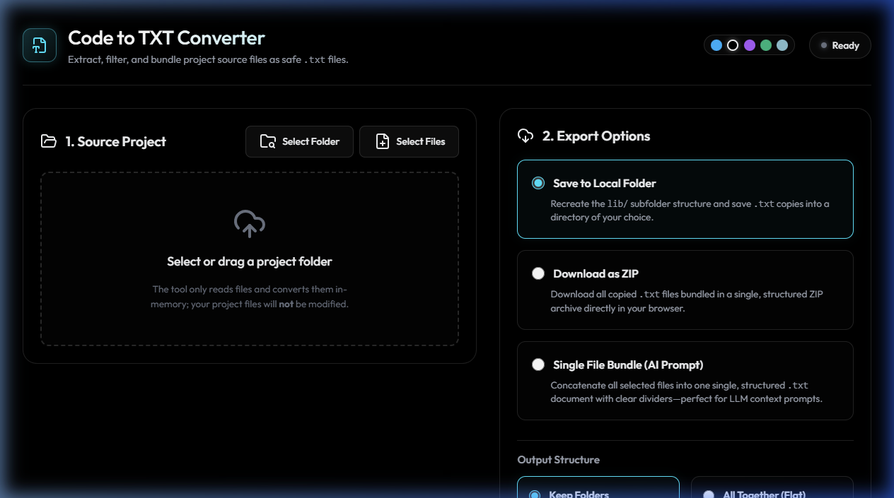
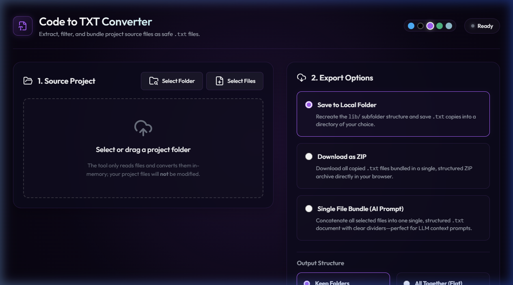
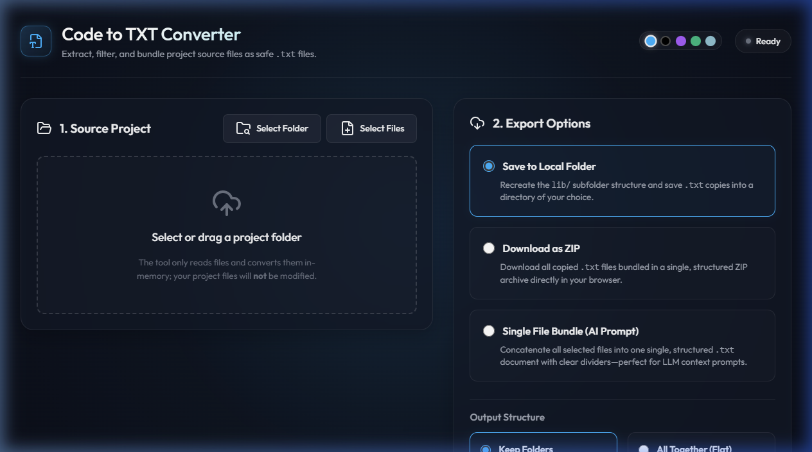

# Universal Code to TXT Converter

A premium, local-first web utility running entirely inside Google Chrome to scan, filter, and bundle project source files into safe `.txt` copies. Perfect for developers who want to share their codebase structure and file contents as context prompts for LLMs (like Gemini, ChatGPT, Claude).

It does **not** touch or modify any files inside your original project folders.

---

## Key Features

- **🗂️ Universal Extension Detection:** Automatically scans your project directories and detects all code extensions (`.py`, `.js`, `.ts`, `.jsx`, `.tsx`, `.dart`, `.yaml`, etc.).
- **🤖 Intelligent Project Auto-Detection:** Automatically detects project frameworks on load (e.g. Flutter, React Native, Python, Web) and configures the recommended selectors.
- **🎛️ One-Click Presets:** Instantly filter file formats using preset configurations for Flutter, React Native, Web, or Python.
- **📄 Single File Bundle (AI Prompt Builder):** Merge all selected files into one single, structured `.txt` document with clear dividers, making it incredibly easy to copy/paste or upload to AI prompts.
- **👁️ Interactive Code Preview:** Preview any file's code directly inside the browser using a sleek, scrollable modal with one-click copy to clipboard.
- **📊 Code Statistics Dashboard:** Live tracking of total file sizes, lines of code (LOC), characters, and estimated AI tokens.
- **🎨 Modern Themes & AMOLED Black:** Beautiful theme toggles including Cyber Blue, Purple Void, Forest Mint, Nordic Frost, and a pure AMOLED Black (default) mode.

---
## Screenshots

### 🖤 AMOLED Black (Default)


### 💜 Purple Void Theme


### 💙 Deep Cyber Theme


---

## Getting Started

Because this utility relies on Chrome's secure **File System Access API** (`showDirectoryPicker`), it must be served from `localhost` rather than opened as a local `file://` link.

### 1. Run the Local Server
Open your terminal (PowerShell or Command Prompt) and run:

```bash
npm run dev
```

This starts a lightweight web server hosting the tool at:
👉 **[http://localhost:3000](http://localhost:3000)**

### 2. How to Use
1. Open **[http://localhost:3000](http://localhost:3000)** in Google Chrome.
2. Select your project folder (or drag and drop it).
3. The tool auto-detects your project format, displays a badge, and checks files.
4. Select your **Export Option**:
   - **Save to Local Folder**: Recreates the folder structure, saving `.txt` copies.
   - **Download as ZIP**: Generates a ZIP archive containing all the `.txt` copies.
   - **Single File Bundle (AI Prompt)**: Concatenates all files into a single structured prompt file.
5. Click **Start Copy Conversion** and monitor progress in the console!
